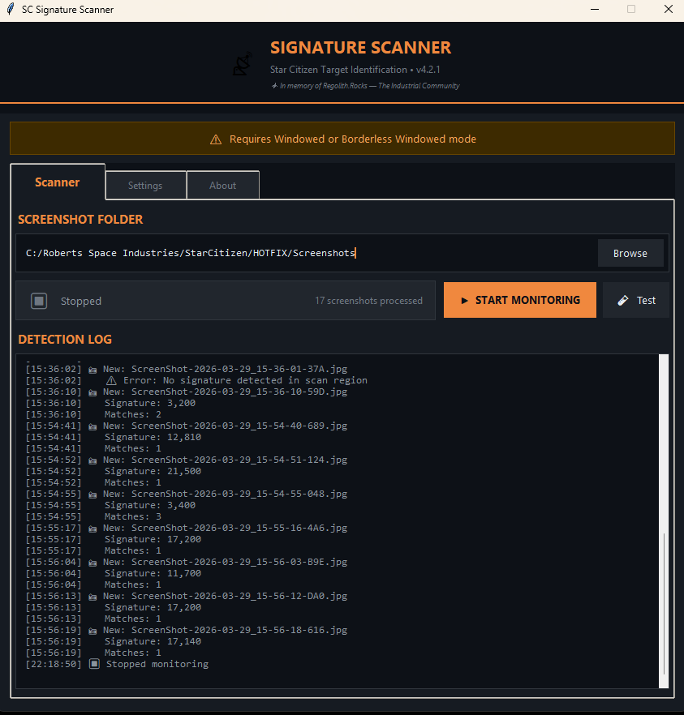
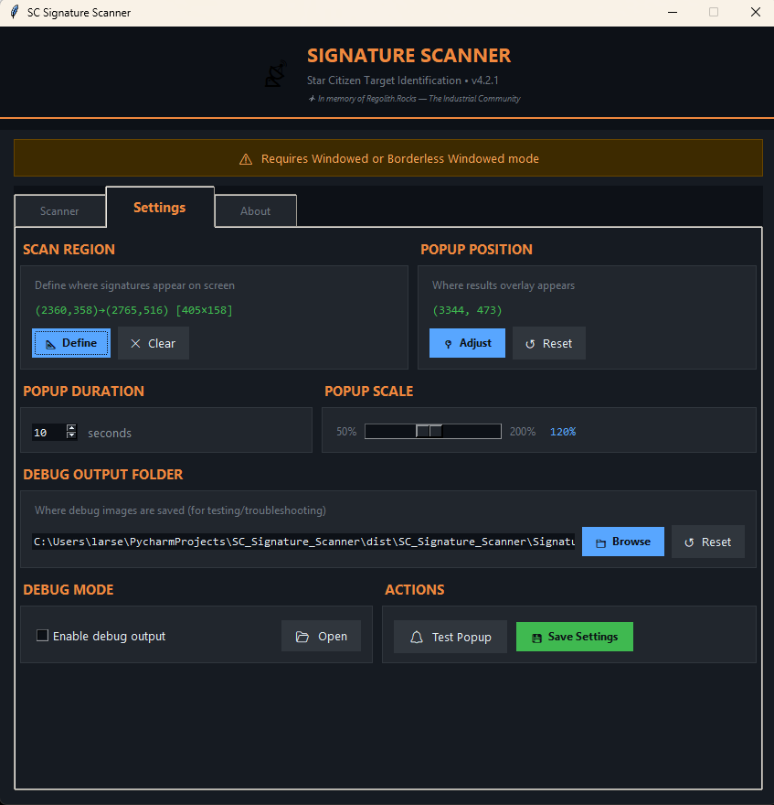
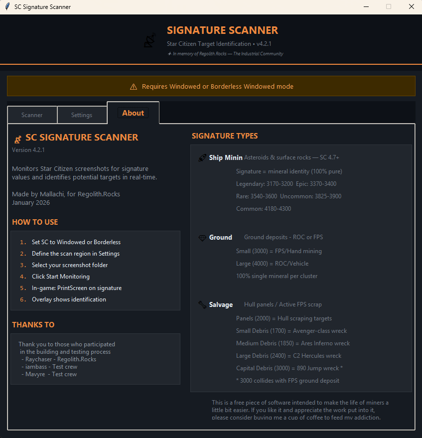

# SC Signature Scanner

[](https://buymeacoffee.com/Mallachi)

Real-time signature identification tool for Star Citizen. Monitors your screenshot folder and automatically identifies asteroids, surface deposits, ground deposits, and salvage targets from in-game signature values.

**Version:** 5.0.0
**Author:** Mallachi
**Game Version:** Star Citizen 4.7+

---

## Screenshots

**Main Scanner window** — Set your Star Citizen screenshot folder, start/stop monitoring, and watch the detection log update in real time as screenshots are processed.



**Settings tab** — Configure the scan region coordinates, overlay position, popup duration and scale, debug output folder, and save your settings.



**Defining the scan region** — Opens an existing screenshot. Click and drag directly over the signature value on your HUD to tell the scanner exactly where to look. Only needs to be done once.


**Test popup** — Preview what the overlay will look like before going in-game. This example shows a Torite (Uncommon) identification at signature 3,900.


**About tab** — Quick reference for all signature types and ranges, setup instructions, and credits.



**In-game overlay** — The identification result appears as a small overlay directly over the game while you're flying. The popup auto-hides after a configurable duration.


---

## Features

### Core Scanning
- **Automatic OCR** — Extracts signature values from screenshots using EasyOCR deep learning
- **SC 4.7 Per-Mineral Identification** — Identifies the dominant mineral of ship-mined rocks by signature value (Legendary through Common tiers)
- **Ground Deposit Detection** — Distinguishes FPS (3000) and ROC/Vehicle (4000) deposit sizes
- **Salvage Detection** — Identifies hull panels and wreck debris by size class
- **Configurable Scan Region** — Define exactly where signatures appear on your screen for faster, more accurate detection

### Overlay Display
- **In-Game Overlay Popup** — Non-intrusive results display over the game
- **Customizable Position** — Drag-to-position overlay anywhere on screen
- **Adjustable Scale** — 50% to 200% size scaling
- **Configurable Duration** — 1–30 seconds display time

### Monitoring & Workflow
- **Folder Monitoring** — Automatically detects new screenshots in your SC screenshot folder
- **Test Screenshot** — Manually test OCR on any image file
- **Detection Log** — Timestamped log of all scans and results
- **Screenshot Counter** — Tracks screenshots processed per session

### Quality of Life
- **Automatic Updates** — Checks for new versions on startup with one-click download
- **Debug Mode** — Saves OCR processing images for troubleshooting
- **Custom Debug Folder** — Choose where debug images are saved
- **Test Popup** — Preview overlay appearance with sample data
- **Splash Screen** — Loading progress display during startup

---

## Requirements

- **Windows 10/11**
- **Star Citizen** in Windowed or Borderless Windowed mode

---

## Quick Start

### For Users (Executable)

1. Download the latest release
2. Extract the `SC_Signature_Scanner` folder
3. Run `SC_Signature_Scanner.exe`
4. Configure your scan region in Settings
5. Start monitoring and take screenshots in-game!

### For Developers (Python)

```bash
# Clone and install
git clone https://github.com/Diftic/SC_Signature_Scanner.git
cd SC_Signature_Scanner
pip install -r requirements.txt

# Run
python app_webview.py
```

> **Note:** First run downloads ~115MB of OCR models to `~/.EasyOCR/model/`

---

## Usage

1. **Configure Scan Region** (first time only)
   - Go to Settings → Define Scan Region
   - Take a screenshot with a signature visible
   - Click and drag to select the signature value area
   - Save the region

2. **Start Monitoring**
   - Set your Star Citizen screenshot folder
   - Click "Start Monitoring"
   - In-game: Press PrintScreen when you see a signature
   - Results appear in an overlay popup

---

## Signature Reference (SC 4.7+)

> SC 4.7 replaced the old rock-type system (I/C/S/P/M/Q/E) with a per-mineral signature system. The signature value now identifies the **dominant mineral** in the rock (40–80% composition). Rocks also contain secondary minerals at lower concentrations.

### Ship Mining — Asteroids & Surface Deposits

| Tier | Signature Range | Minerals |
|------|----------------|---------|
| **Legendary** | 3170–3200 | Quantainium (3170), Stileron (3185), Savrilium (3200) |
| **Epic** | 3370–3400 | Ouratite (3370), Riccite (3385), Lindinium (3400) |
| **Rare** | 3540–3600 | Beryl (3540), Taranite (3555), Borase (3570), Gold (3585), Bexalite (3600) |
| **Uncommon** | 3825–3900 | Laranite (3825), Aslarite (3840), Titanium (3855), Tungsten (3870), Agricium (3885), Torite (3900) |
| **Common** | 4180–4300 | Hephaestanite (4180), Tin (4195), Quartz (4210), Corundum (4225), Copper (4240), Silicon (4255), Iron (4270), Aluminum (4285), Ice (4300) |

Applies to both asteroids and surface deposits (Prospector/MOLE).

### Ground Deposits

100% single mineral per cluster. Signature identifies **size**, not mineral type.

| Variant | Signature | Method |
|---------|-----------|--------|
| Small | 3000 | FPS / Hand mining |
| Large | 4000 | ROC / Vehicle mining |

**Possible minerals:** Hadanite, Dolivine, Aphorite, Beradom, Glacosite, Feynmaline, Jaclium, Sadaryx, Janalite, Saldynium, Carinite

> **Note:** Large ground deposits (4000) share a signature with Common-tier ship-mining rocks. Context (planet surface vs. space) is required to distinguish them.

### Salvage

| Type | Signature | Notes |
|------|-----------|-------|
| Hull Panels / Active Scrap | 2000 | Per panel — 2000 × N |
| Small Debris | 1700 | Avenger-class wrecks, scrap cargo containers |
| Medium Debris | 1850 | Ares Inferno-class wrecks |
| Large Debris | 2400 | C2 Hercules-class wrecks |
| Capital Debris | 3000 | 890 Jump-class wrecks |

> **Collision:** Capital debris (3000) shares a signature with FPS small ground deposits. Use context to distinguish.

### Undetectable

Vlk Pearls, Vlk Irradiated Pearls, and Flowstone have a signature of 0 and cannot be detected by this scanner.

---

## Configuration

Settings saved to `config.json`:

| Setting | Description |
|---------|-------------|
| Screenshot folder | Path to Star Citizen screenshots |
| Overlay position | Screen coordinates for popup |
| Overlay duration | Seconds to display (1–30) |
| Overlay scale | Size multiplier (0.5–2.0) |
| Debug mode | Save OCR processing images |

---

## File Structure

```
SC_Signature_Scanner/
├── SC_Signature_Scanner.exe  # Main executable
├── _internal/                # Runtime dependencies
│   └── data/
│       └── combat_analyst_db.json
├── config.json               # User settings (created on first run)
└── scan_region.json          # Scan region config
```

---

## Troubleshooting

**"No signature detected"**
- Ensure scan region is correctly configured
- Screenshot must capture the signature value clearly
- Try adjusting in-game UI scale

**"OCR not available"**
- First run requires internet to download models (~115MB)
- Check `~/.EasyOCR/model/` exists after download

**Overlay not visible**
- Game must be in Windowed or Borderless Windowed mode
- Check overlay position isn't off-screen

**Wrong identification**
- Signature 4000 matches Large Ground Deposits, Common-tier ship rocks, and old Surface Deposits — context required
- Signature 3000 matches FPS Ground Deposits and Capital (890 Jump) wreck debris — context required

**Slow startup**
- Normal — PyTorch/EasyOCR takes 15–20 seconds to load
- Splash screen shows loading progress

---

## Data Sources

- **Signatures:** Extracted directly from Star Citizen game files (`Game2.dcb` via `Data.p4k`)

---

## Credits

- **Developer:** Mallachi
- ✦ *In memory of Regolith.Rocks — The Industrial Community*

---

## License

MIT License — Free to use, modify, and distribute. See [LICENSE](LICENSE) for details.

*Not affiliated with Cloud Imperium Games or Roberts Space Industries.*
